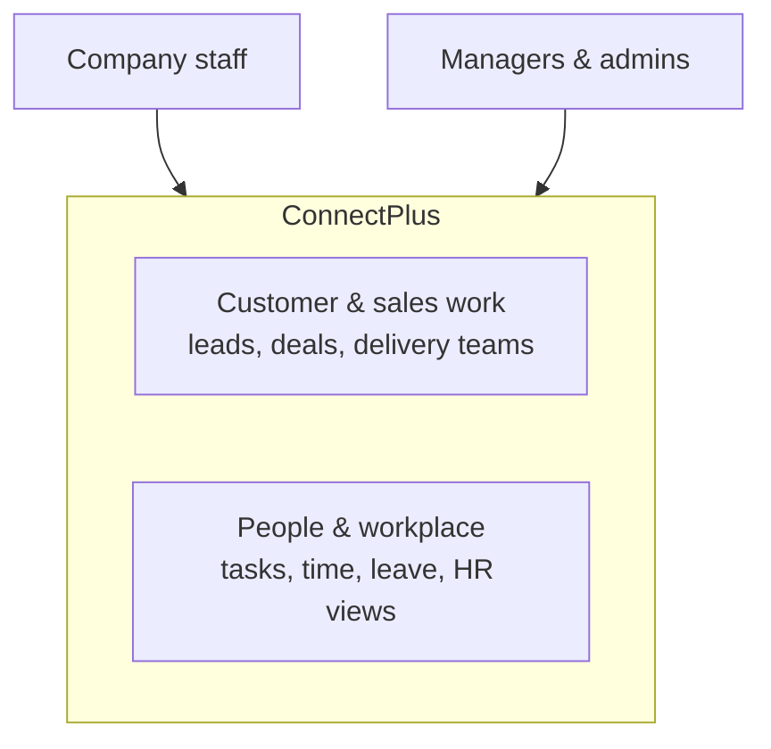
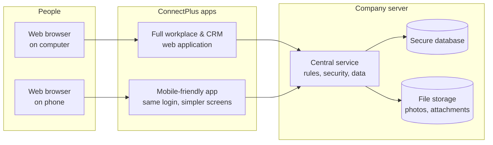
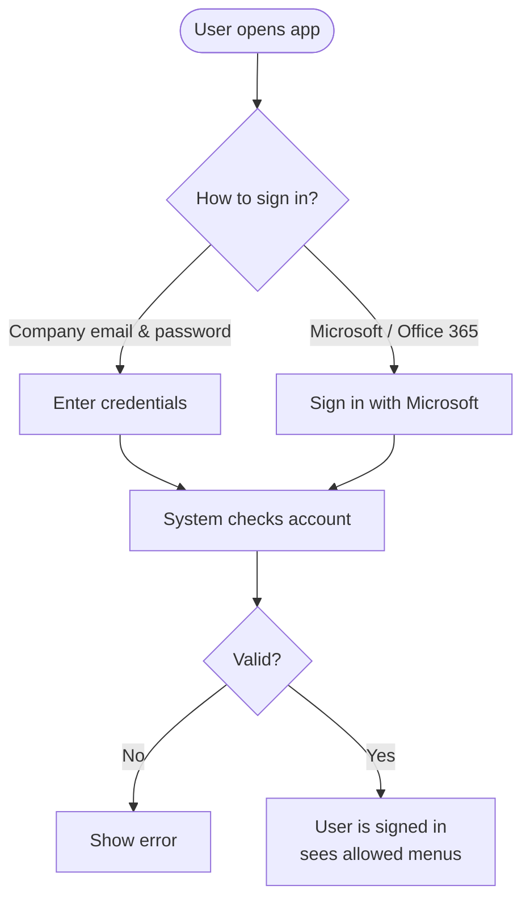
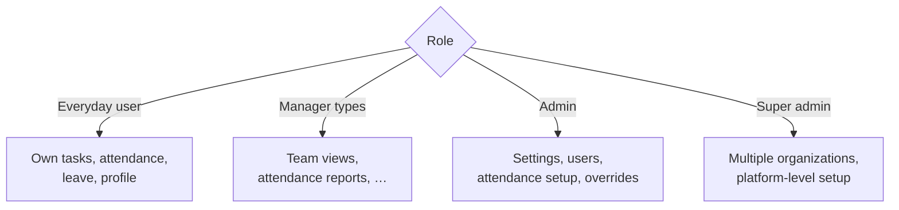
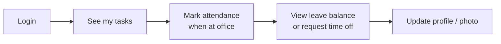
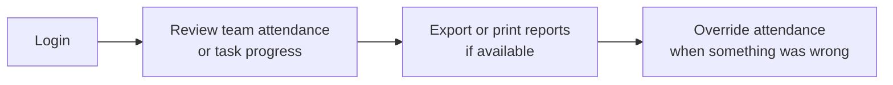
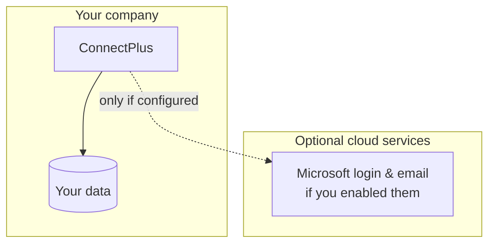
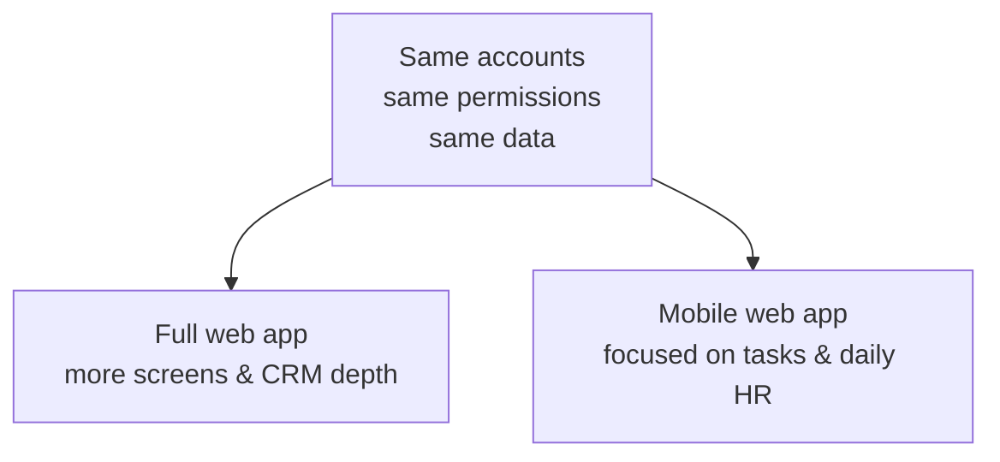

# ConnectPlus — system design (flowcharts)

What the product is, who uses what, and how information moves—without engineering detail.

---

## What ConnectPlus is

One company account holds **organizations**, **users**, and **roles** (who can see or change what).

---

## Main pieces of the system

**Plain words:** Staff use either the **full web app** or the **mobile web app**. Both talk to the same **central service** that stores data in a **database** and **files** where needed.

---

## Signing in

New employees from the company domain can often be **created automatically** the first time they sign in with Microsoft, and placed in the right **organization**.

---

## Who sees what (idea)

Exact menus depend on how your company configured **roles** and **modules**.

---

## Typical day for an employee (mobile)

---

## Typical day for a manager

---

## Data stays with the company

Customer and HR data live in **your** database; Microsoft is used only for **sign-in** (and optional mail features) if you turned that on.

---

## How the two apps relate

---

## Related document

- **[Attendance — system design](./ATTENDANCE_ARCHITECTURE.md)** — flowcharts only for check-in (location + face).

---

*For technical implementation (APIs, databases, file paths), refer to the source code and developer docs.*
