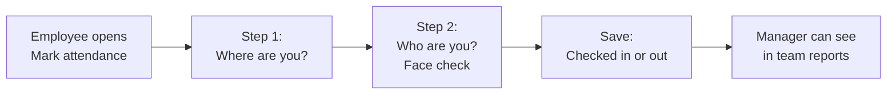
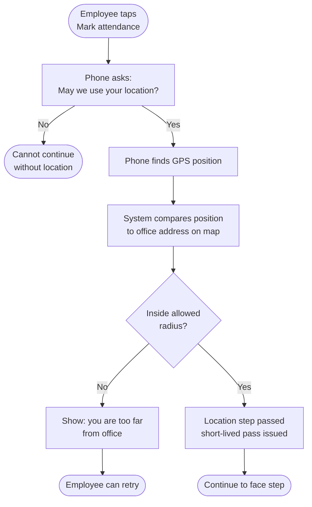
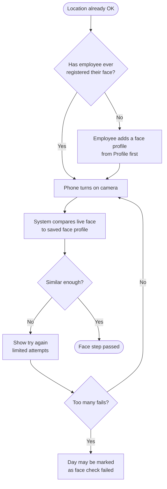
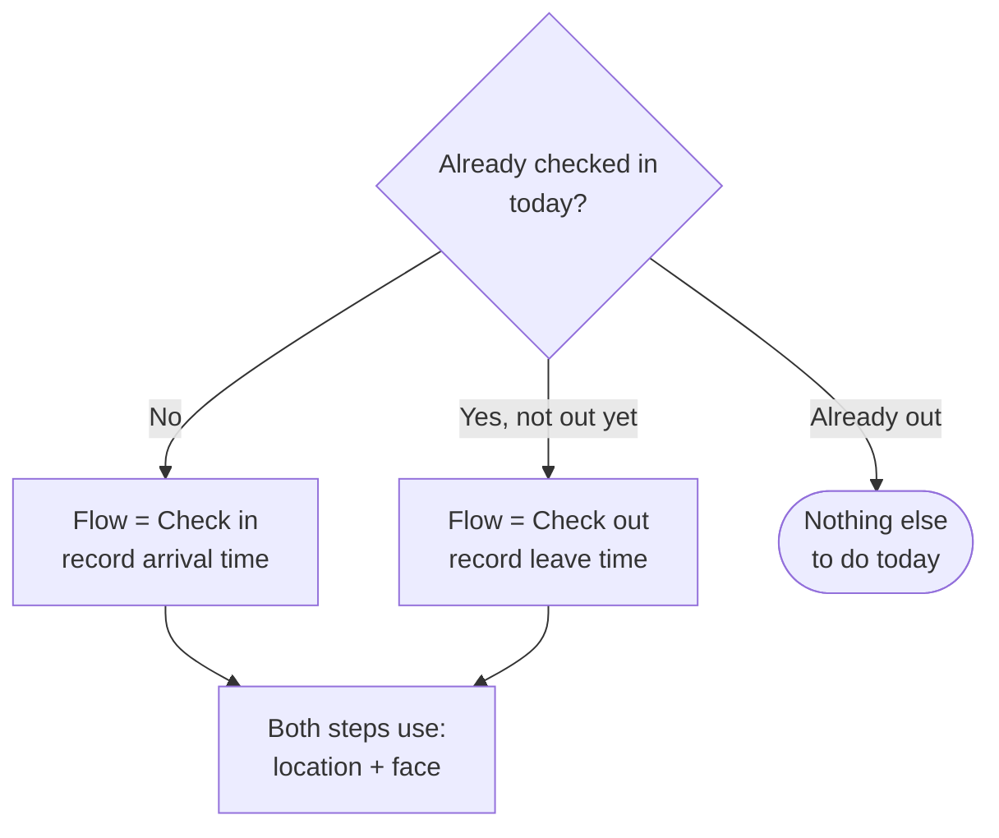
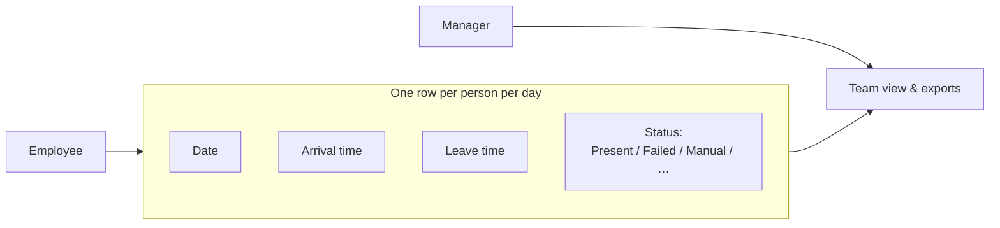
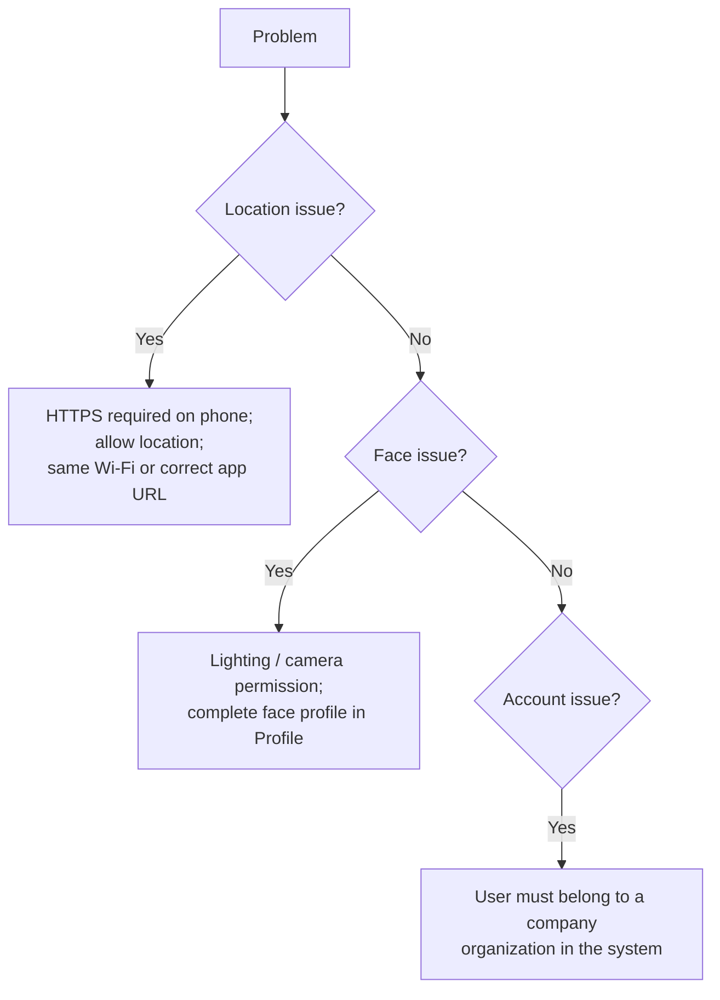
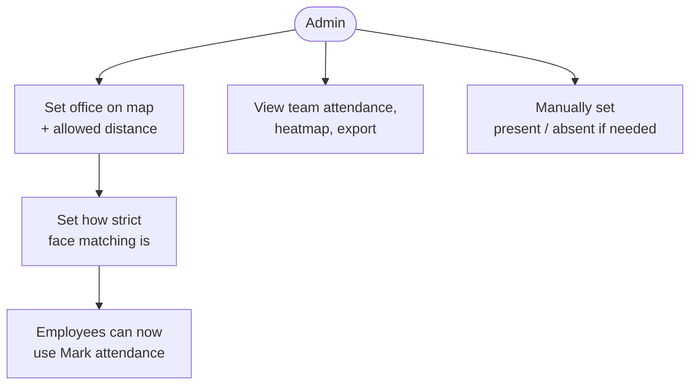

# Attendance — system design (flowcharts)

How **Mark attendance** works: the system checks **where** you are and **who** you are before recording your day.

---

## Big picture

---

## Step 1 — Location (are you at the office?)

**In plain words:** The office location and “how close is close enough” are set once by an admin. The phone must be allowed to use GPS, and the employee must be within that distance.

---

## Step 2 — Face (is it really you?)

**In plain words:** Earlier, the employee saves a “face profile” from a photo or camera. At check-in, the live camera must match that profile within a tolerance set by the company.

---

## Check-in vs check-out

---

## What gets saved (conceptual)

---

## When things go wrong

---

## Admin side (setup)

---

*This describes behavior, not code. For implementation detail, see the codebase.*
